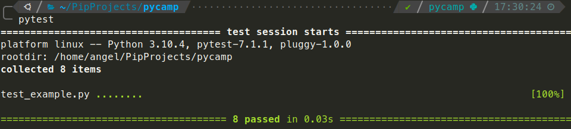

# TDD Katas

## A Python workshop

---

### Who we are

#### Àngel Fernández (@anxodio)
Staff Engineer at Holaluz

-

#### Israel Saeta (@dukebody)
Engineering Manager at Travelperk

---

## What is software testing

----

> Software Testing is a method to check whether the actual software product matches expected requirements and is defect free

Note:
Al final busca comprovar requeriments, descobrir bugs, etc

Amb el public, se us acuden exemples? beta testing per exemple ho coneix quasi tothom

----

You can test software manually, but also it can be

### ✨🌈 automated 🌈✨

----

### Types of automated tests

- Unit tests
- Integration tests
- End to end tests
- And more (functional, acceptance, performance, ui...)

Note:
Explicar que ens centrarem sobretot en els unit test

----

### Types of automated tests


Note:
Passar per sobre per explicar la importancia dels unit test com a fonaments

---

## Testing in Python

----

### A simple Python test example

```python
def add_one(x: int) -> int:
    return x + 1
```

```python
def test_add_one() -> None:
    assert add_one(-1) == 0
    assert add_one(7) == 8
```

<!-- .element: class="fragment fade-in" -->

Note:
Aprofitar per explicar type hinting com a forma extra de validar el nostre software
Explicar que hi ha varies formes de testejar en python, aqui simplifiquem a pytest

----

### How executing tests looks like




----

### How executing tests looks like


---

## Test Driven Development (TDD)

----

> TDD is a **software development process** that relies on **writing the tests first** and then writing the code that pass those test in an **iterative** way.

Note:
Es podria entrar més en detall (detroit o london per exemple), pero no es el moment

----

### Three Rules of TDD

1. Write production code only to pass a failing unit test.
2. Write no more of a unit test than sufficient to fail (compilation failures are failures).
3. Write no more production code than necessary to pass the one failing unit test.

----

### Red Green Refactor


----

### TDD Example

```python
def test_add_two_numbers() -> None:
    assert add_two_numbers(1, 2) == 3
    assert add_two_numbers(-5, 5) == 0
```

NameError: name 'add_two_numbers' is not defined

<!-- .element: style="color: red" class="fragment fade-in" -->

----

### TDD Example

```python
def add_two_numbers(x: int, y: int) -> int:
    return x + y

def test_add_two_numbers() -> None:
    assert add_two_numbers(1, 2) == 3
    assert add_two_numbers(-5, 5) == 0
```

Test OK

<!-- .element: style="color: green" class="fragment fade-in" -->

---

## What is a Kata


> A code kata is an exercise in programming which helps software developers improve their skills through practice and repetition

_Dave Thomas, co-author of the book The Pragmatic Programmer_

Note:
Explicar que s'acostuma a fer en comunitat, pair o mob, practicar TDD o SOLID o coses concretes,
que molts cops son exercicis senzills perque importa el com...

---

## So let's work
### The URL Shortener Kata


---

### Requirement 1
Write a library that shortens URLs

> With a method that accepts a long URL and returns the shortened URL, like `https://short.url/abc1234`

---

### Requirement 2
Store URLs

> The long and shortened URL should be stored together (some in-memory store is enough)

---

### Requirement 3
Translate method

> The library should have a method called `translate` which takes in a shortened URL and returns the long URL

---

### Requirement 4
The counter

> The library should track the number of times the short URL is visited.

---

### Requirement 5
Statistics

> An statistics method that accepts a long or short URL and returns the short, the long URL, and the number of times that was accessed.

---

### Requirement 6
Validation

> If an invalid URL is provided, an understandable error should be raised

---

### Requirement 7
Duplicates

> Detect existing URLs and return the same short URL instead of creating a duplicate

---

### Requirement 8
Log access

> Log the datetime each short url was accessed and create a log method similar to the statistics method, returning the complete history

---


# Thank you!
