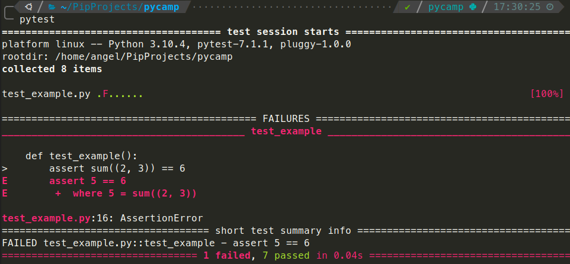

# TDD Katas

## An introductory Python workshop

---

## What is software testing

---

> Software Testing is a method to check whether the actual software product matches expected requirements and is defect free

Note:
Al final busca comprovar requeriments, descobrir bugs, etc

Amb el public, se us acuden exemples? beta testing per exemple ho coneix quasi tothom

---

You can test software manually, but also it can be

### ✨🌈 automated 🌈✨

---

### Types of automated tests

- Unit tests
- Integration tests
- End to end tests
- And more (functional, acceptance, performance, ui...)

Note:
Explicar que ens centrarem sobretot en els unit test

---

### Types of automated tests


Note:
Passar per sobre per explicar la importancia dels unit test com a fonaments

---

## Testing in Python

---

### A simple Python test example

```python
def add_one(x: int) -> int:
    return x + 1
```

```python
def test_add_one() -> None:
    assert add_one(-1) == 0
    assert add_one(7) == 8
```

<!-- .element: class="fragment fade-in" -->

Note:
Aprofitar per explicar type hinting com a forma extra de validar el nostre software
Explicar que hi ha varies formes de testejar en python, aqui simplifiquem a pytest

---

### How executing tests looks like


---

### How executing tests looks like





---

## Test Driven Development (TDD)

---

> TDD is a **software development process** that relies on **writing the tests first** and then writing the code that pass those test in an **iterative** way.

Note:
Es podria entrar més en detall (detroit o london per exemple), pero no es el moment

---

### Three Rules of TDD

1. Write production code only to pass a failing unit test.
2. Write no more of a unit test than sufficient to fail (compilation failures are failures).
3. Write no more production code than necessary to pass the one failing unit test.

---

### Red Green Refactor


---

### TDD Example

```python
def test_add_two_numbers() -> None:
    assert add_two_numbers(1, 2) == 3
    assert add_two_numbers(-5, 5) == 0
```

NameError: name 'add_two_numbers' is not defined

<!-- .element: style="color: red" class="fragment fade-in" -->

---

### TDD Example

```python
def add_two_numbers(x: int, y: int) -> int:
    return x + y

def test_add_two_numbers() -> None:
    assert add_two_numbers(1, 2) == 3
    assert add_two_numbers(-5, 5) == 0
```

Test OK

<!-- .element: style="color: green" class="fragment fade-in" -->

---

## What is a Kata


> A code kata is an exercise in programming which helps software developers improve their skills through practice and repetition

_Dave Thomas, co-author of the book The Pragmatic Programmer_

Note:
Explicar que s'acostuma a fer en comunitat, pair o mob, practicar TDD o SOLID o coses concretes,
que molts cops son exercicis senzills perque importa el com...

---

## So let's work
### The Greeting Kata

Note:
Pensada senzilla per practicar el testing i el refactoring continuu

---

### Requirement 1
Write a method `greet(name)` that interpolates name in a simple greeting.

_For example, when `name` is `"Alice"`, the method should return a string `"Hello, Alice."`._

---

### Requirement 2
Handle nulls by introducing a stand-in.

_For example, when `name` is `null`, then the method should return the string `"Hello, my friend."`._

---

### Requirement 3
Handle shouting. When `name` is all uppercase, then the method should shout back to the user.

_For example, when `name` is `"JERRY"` then the method should return the string `"HELLO JERRY!"`._

---

### Requirement 4
Handle two names of input. When `name` is an array of **two** names then both names should be printed.

_For example, when name is `["Jill", "Jane"]`, then the method should return the string `"Hello, Jill and Jane."`_

---

### Requirement 5
Handle an arbitrary number of names as input. When `name` represents more than two names, separate them with commas and close with an Oxford comma and "and".

_For example, when name is `["Amy", "Brian", "Charlotte"]`, then the method should return the string `"Hello, Amy, Brian, and Charlotte."`_

---

### Requirement 6
Allow mixing of normal and shouted names by separating the response into two greetings.

_For example, when name is `["Amy", "BRIAN", "Charlotte"]`, then the method should return the string `"Hello, Amy and Charlotte. AND HELLO BRIAN!"`_

---

### Requirement 7
If any entries in `name` are a string containing a comma, split it as its own input.

_For example, when `name` is `["Bob", "Charlie, Dianne"]`, then the method should return the string `"Hello, Bob, Charlie, and Dianne."`._

---

### Requirement 8
Allow the input to escape intentional commas introduced by Requirement 7. These can be escaped in the same manner that CSV is, with double quotes surrounding the entry.

_For example, when `name` is `["Bob", "\"Charlie, Dianne\""]`, then the method should return the string `"Hello, Bob and Charlie, Dianne."`._

---

# Thank you!
